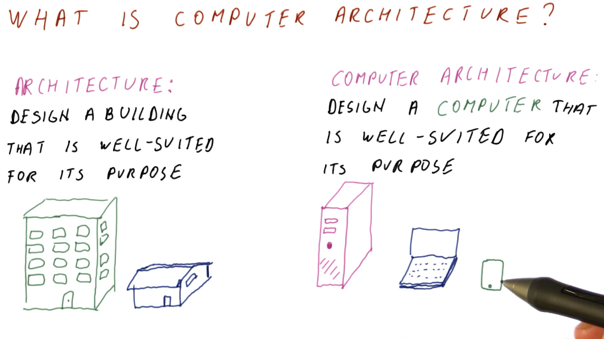
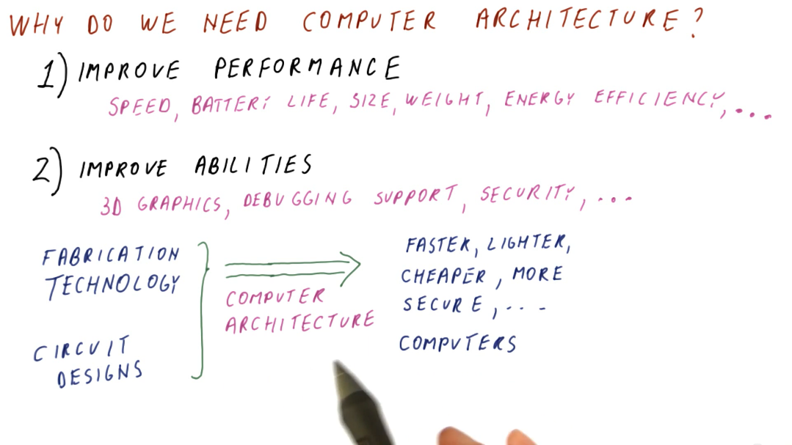
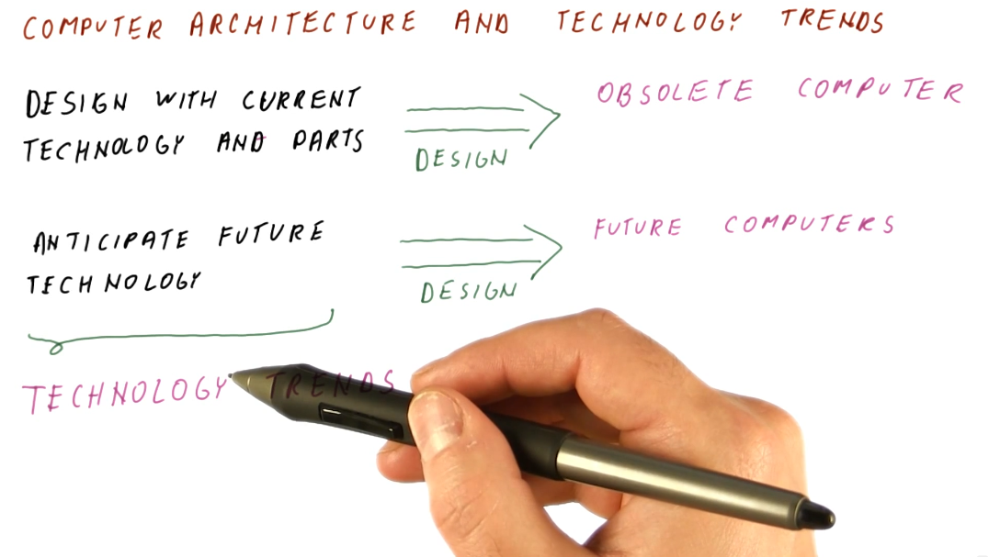
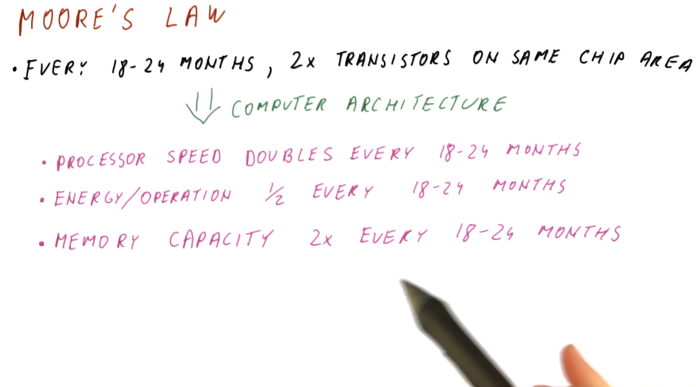
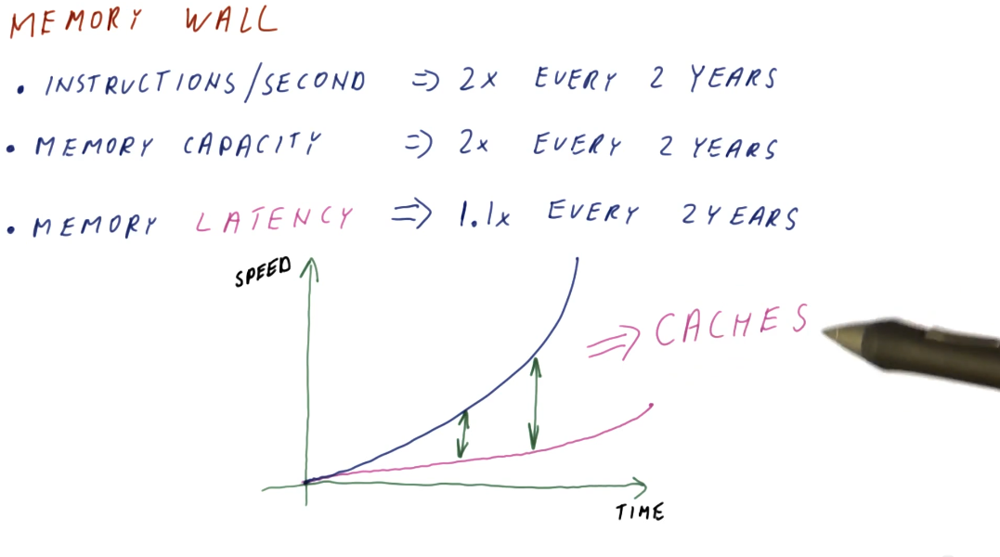
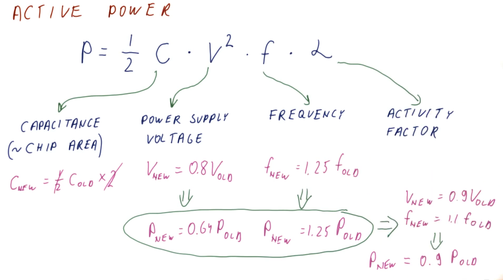
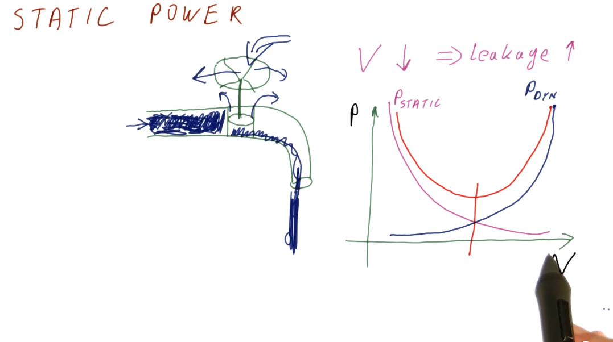
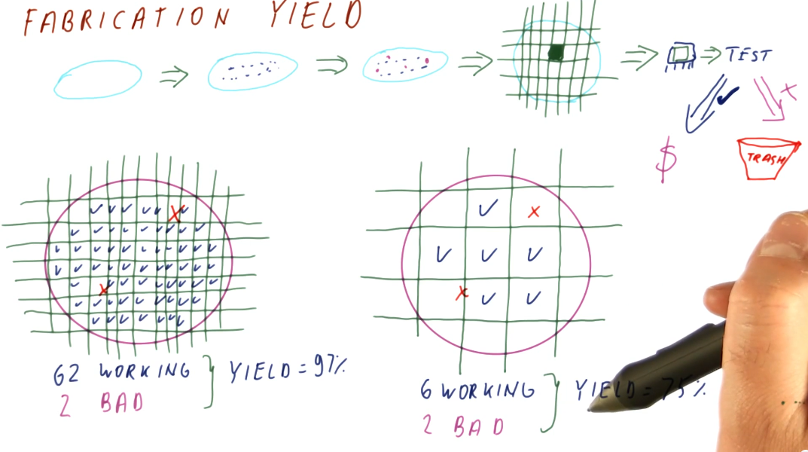
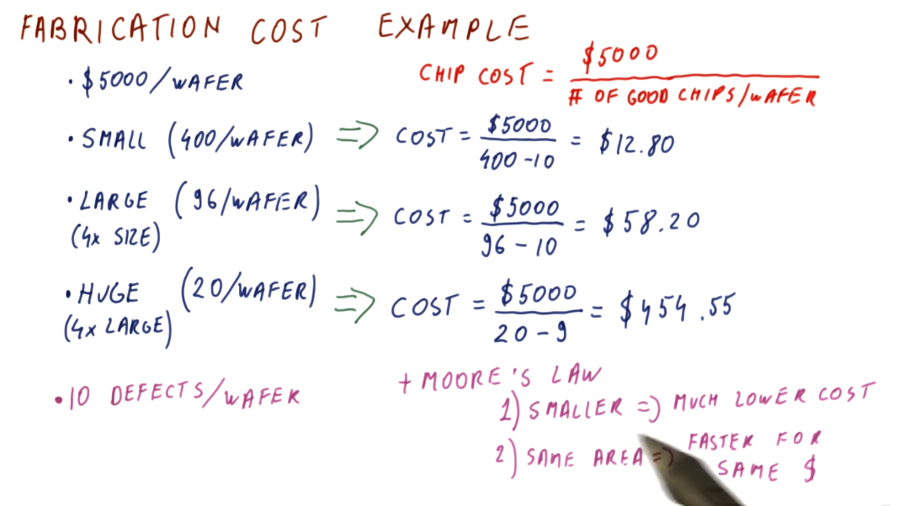

# Introduction

## What is computer architecture?

We can think of computer architecture similar to how architecture is considered
for building. Buildings are designed to be well-suited for a specific purpose.
The same can be said of computers, as we design different computers for
different purposes. Some examples are desktop computers, laptops, and
cellphones; they all have different purposes and require different computer
architectures.

## Why do we need computer architecture?

1. To improve performance based upon some specific measure. These measures
could include:
* Speed
* Battery life
* Size
* Weight
* Energy efficiency, etc.
2. To improve the abilities provided by a computer. These abilities could include:
* 3D graphics
* Debugging support
* Security, etc.

The first need for computer architecture is about making computers cheaper,
faster, smaller, etc. while the second need is based around making new things
possible/providing new functionality. Computer architecture utilizes discoveries
in fabrication technology and circuit design to achieve the goals stated above.

## Computer architecture and technology trends

Computer architecture is about building future computers. The progress in
computer manufacturing technology is fast. We shouldn't design a new computer
with current technology and parts. By the time we've designed our new computer,
it's obsolete and using old technology. We need to track technology trends in
order to predict what's available in the future, allowing us to better design a
new computer using these new technologies.

## Moore's law

Moore's law provides a good starting point for predicting what future computers
will look like based upon what is currently available today. As computer
architects, we can use these predictions to guide our expectations of what
technologies will be available for use when designing future computers. Below is
a high-level summary of Moore's law:

## The memory wall

Processor speed doubles almost every two years, while memory capacity also
experiences the same phenomenon. Memory latency, however, has not kept pace with
processor speed and memory capacity. This is what's called the memory wall and,
in order to mitigate these differences in speed when processors need to access
memory, we have been using caches to close that gap. Caches can be thought of as
a series of stairs for memory access speed, and cache misses are the base of the
staircase with the slowest memory access speed possible. A high-level
illustration of the memory wall trend is provided below:

## Power consumption

There are two kinds of power that a processor consumes:
* Dynamic (active) power - consumed by activity in a circuit
* Static power - consumed when powered on but idle

### Active power

Below is an illustrative representation of the equation for calculating active
power consumption by a processor. The representation also displays how we can
calculate the change in active power consumption when a different chip
configuration is used, and if voltage and chip frequency are changed. An
explanation of each variable in the active power equation follows:
* capacitance - roughly proportional to chip area / larger chips will have more
capacitance
* voltage - quadratic relationship between voltage and power consumption
* frequency - clock frequency (GHz) of a processor
* alpha - activity factor (percentage of processor transistors active for any
given clock cycle)

### Static power

Static power is power consumed while the processor is idle. Some of this is due
to the voltage being too low to prevent transistors from leaking/wasting energy,
but it can also come from other sources as well. Below is a high-level
representation identifying the relationship between static and active power as
voltage increases or decreases in the circuit. This representation also
identifies that there is some optimal voltage settings for circuits to avoid
utilize too much power in bot the active and static states.

## Fabrication cost and yield

The cost to manufacture and convert silicone wafers to useable computer chips
is pretty much static. We, primarily, have to account for chip yield when a
silicone wafer is divided into a number computer chips - some of these chips
can have defects while others work fine. Below is high-level representation of
the silicone wafer to computer chip manufacturing process, and how the yield
is derived based upon the number of defects in wafer versus the number of chips
extracted from a wafer.

Below is an example of how we can calculate the fabrication cost per chip
based upon chip size. Smaller chips cost less to manufacture, while larger chips
cost the most. Smaller chips, over time according to Moore's Law, will be able
to do more for less as we are able to fit smaller transistors onto the chips.
Larger chips will be able to remain the same size and cost, however, they will
be faster overall due to Moore's Law.

## References

1. [Lesson 1 Notes](./pdf/Lesson1Notes.pdf)
