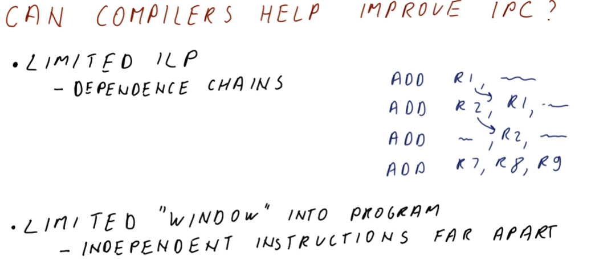

# Compiler ILP

In previous lessons we discussed out-of-order execution processors that attempt
to execute more than one instruction per cycle. In this lesson we will discuss
how compilers can support this process.

The notes for this lecture can be found [here](./pdf/lesson10.pdf).

## Can compilers improve IPC?

At the processor level, we face a couple of obstacles that prevent us from
further improving our IPC and performance. These include:

* **dependence chains** - a program can contain dependency chains that could
otherwise not exist if a compiler were to remove the dependencies and use other
registers for storing information.
* **limited "window" into the program** - a processor can only see so many
instructions at once. Independent instructions that could be executed
concurrently could exist far from each other in the program, not leveraging the
out-of-order execution capability of the processor.

Below is a high level representation of the concepts discussed above with some
pseudo-assembly.

