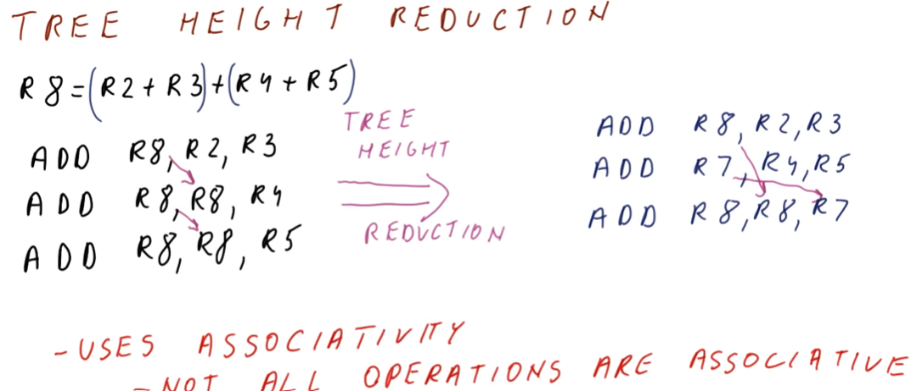
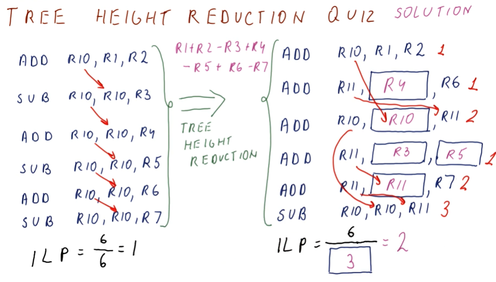

# Tree Height Reduction

Using **Tree Height Reduction**, compilers remove dependency chains from the program
by identifying operations than can be conducted concurrently and separating
them. In the example below, our code wants to store the summation of four
operands into the register `R8`. Without **Tree Height Reduction**, our code would
create a dependency chain as we execute sequential instructions to add to
register `R8`. With **Tree Height Reduction**, the compiler groups the operations
and removes the dependency by using another register, `R7`, to hold the
intermediate value.

We aren't able to use **Tree Height Reduction** all of the time as it uses
associativity. If an operation isn't associative, **Tree Height Reduction**
cannot be applied.

## Tree Height Reduction Quiz

Below is a quiz from the lectures showcasing how to conduct **Tree Height
Reduction** with a set of assembly instructions. To solve the quiz, we must
reconstruct the original expression from the assembly instructions. Then we
group together the `ADD` operations and get the final value for all of the
positive numbers. Next we group together all of the negative numbers with
`ADD` operations, and then we subtract the two summations.

Once we identify all of the dependencies in the reduced assembly code, we can
see that the new code is able to execute more instructions out-of-order, and we
double our ILP.

