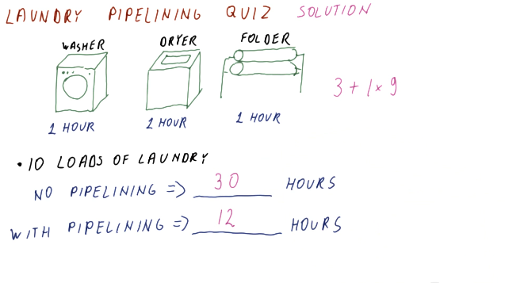

# Pipelining

This lesson reviews pipelining to set the stage for more advanced topics.

## Pipelining in a processor

This section covers basic pipelining in a processor. Most processors are much
more complex than the example provided here, however, this is used to review
content for students.

In a traditional processor pipeline, we have are series of stages. The following
listing of stages is not *all* stages, but it encompasses the important ones:
* **fetch**
* **read**
* **decode**
* **execute**
* **memory access**
* **write**

So how does pipelining apply to these stages? Instead of fetching, decoding, and
executing one instruction at a time, while one instruction is being decoded,
another instruction can be fetched from instruction memory. Then, when one
instruction is being executed, we can be decoding the instruction behind it.
So, while the latency may not change, the throughput of instructions through
the pipeline increases. Below is a high level representation of this concept:

Below is an example of calculating the latency of process with and without a
pipeline.

Below is a similar example as the one above, however, this one applies to
instructions and cycles.

## Pipeline cycles per instruction

Throughout these notes we've been assuming one cycle per instruction, or a CPI
of 1, when our pipeline is full. In the real-world, however, we'll have billions
of instructions to execute - will our CPI always be 1? Here are some reasons
why our CPI might not be 1:

* **initial fill** - when the pipeline initially fills up, our CPI will not be
equal to 1. Regardless, as our instruction number reaches infinity, CPI will
begin to approach 1.
* **pipeline stalls** - there exists the possibility that a fault occurs in the
pipeline and an instruction stalls, causing it to have to remain at that stage
for a cycle.

Below is a high-level representation of how a CPI can be greater than 1.

## References

1. [Lesson 3 Notes](./pdf/Lesson3Notes.pdf)