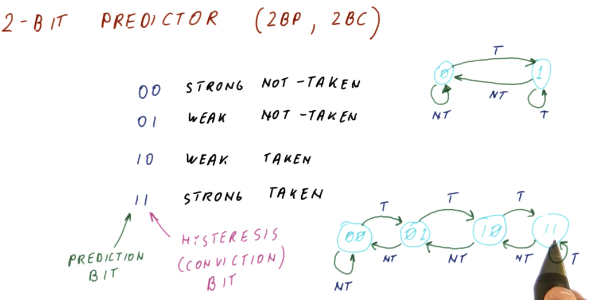
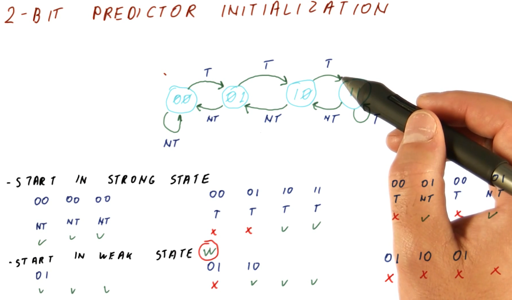
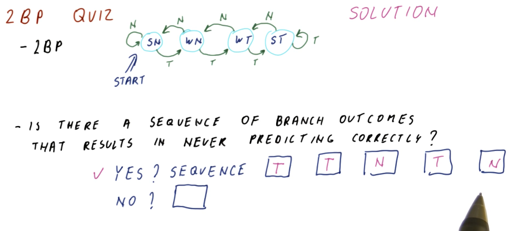
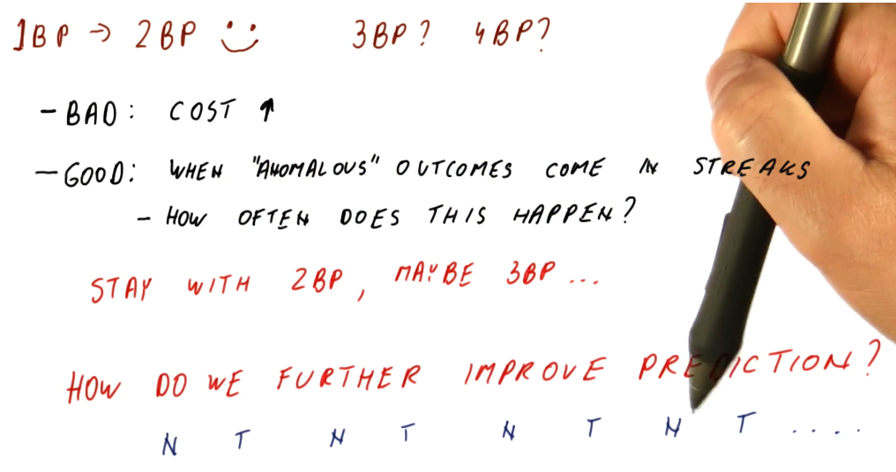

# 2 Bit Predictor

A 2 bit predictor or 2 bit counter (2BP or 2BC) just adds another bit to the BHT
to implement a state machine. The first bit in the 2BP is the prediction bit,
and the second bit is called the **hysteresis** or conviction bit. These are the
states of the 2BP:

* `00` - strong not-taken state
* `01` - weak not-taken state
* `10` - weak taken state
* `11` - strong taken state

You can probably see where this is going. We start out in the strong not-taken
state for a program counter. When we mis-predict that a branch is not-taken, we
increment the hysteresis bit and transition to the weak not-taken state. We
still don't take the branch until we are proven incorrectly again. A
mis-prediction at this point will transition us to the weak taken state.

So unlike the 1 bit predictor, our affinity to take or not take a branch doesn't
flip as easily. This solves the problem we had earlier where, if we encountered
an anomaly for a branch that is usually taken or not taken, we won't incur a
penalty of two mis-predictions.

## 2 Bit Predictor initialization

The below excerpt from the lectures demonstrates that it's a good idea to
initialize the 2 bit predictor in a weak state, doesn't matter if it's taken or
not taken. This is because, at program start, we don't know the history of the
branches, yet, so starting in the weak state only incurs 1 mis-prediction
penalty while starting in a strong state incurs 2.

On the flip-side, if a branch flip-flops and we start in the weak state, we will
incur a mis-prediction penalty every single time we encounter the branch. This
isn't common behavior (fortunately).

The evidence provided above would give you the idea that we should always init
the 2 bit predictor in the weak state, but for the sake of practicality, it
really doesn't matter and most 2 bit predictors are initialized at `00`.

## 2 Bit Predictor Quiz

The below quiz excerpt from the lectures demonstrates how there is a worst-case
scenario for the 2 bit predictor, showcasing a series of branches that will
cause the predictor to mis-predict every branch.

The moral of the story is, **every** predictor will have a worst-case scenario.
A good predictor will make it difficult to find or generate this worst-case
sequence of branches.

## 1 bits, 2 bits... what else?

So we've seen that the 2 bit predictor is better than the 1 bit predictor at
handling anomalous outcomes. Does this get better if we add 3 bits to the
predictor? Well, maybe. Another bit will just increase the number of states,
making it more difficult to transition to another prediction - this is useful
if the anomalous behavior comes in streaks. This behavior is not common, however
, in programs. Adding another bit imposes more cost, as it requires more space
to store the information per program counter.

A 2 bit predictor meets the needs we identified earlier of handling anomalous
behavior, but what about that one case where the branch outcome kept
flip-flopping? Since increasing the number of bits to solve this problem doesn't
really do anything, what's the next solution?

