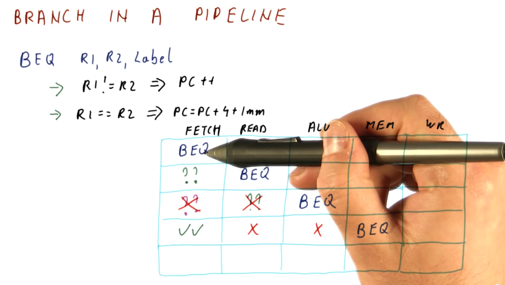

# Branches

In the previous [pipelining](../lesson3/pipelining.md) lesson, we saw the
effects that hazards have on performance. Branches and jumps are common
instructions that introduce control dependencies - our only solution can't just
be to flush the processor pipeline each time a branch or jump is decoded. This
lesson covers techniques used to effectively avoid hazards introduced by control
dependencies.

## Branch in a pipeline

The example provided below uses a 5 stage processor pipeline to demonstrate the
costs of incorrect branch prediction. The example explains how a branch
instruction works: is registers `R1` and `R2` are equal, the immediate value
represented by `Label` will be added to the program counter, `PC`, and execution
will begin at that location in memory. Otherwise, the program counter will be
incremented regularly - `R1` and `R2` are not equal.

In this scenario, a branch instruction enters the pipeline at cycle 1. The
branch instruction isn't evaluated until cycle 3 by the ALU. Meanwhile, two
instructions are fetched and decoded - these are represented by a `??` because
the instructions can be fetched either from memory directly after the branch
instruction or the landing location in memory if the branch instruction is
taken.

If we predict the outcome of the branch instruction correctly, the instructions
that were fetched and decoded will execute immediately after the branch
instruction leaves the pipeline - the branch will have taken 1 cycle to
complete. If we predicted the outcome of the branch incorrectly and loaded the
wrong instructions into the pipeline, these instructions will have to be flushed
and the branch will have taken 3 cycles to complete.

## References

1. [Lesson 4 Notes](./pdf/Lesson4Notes.pdf)