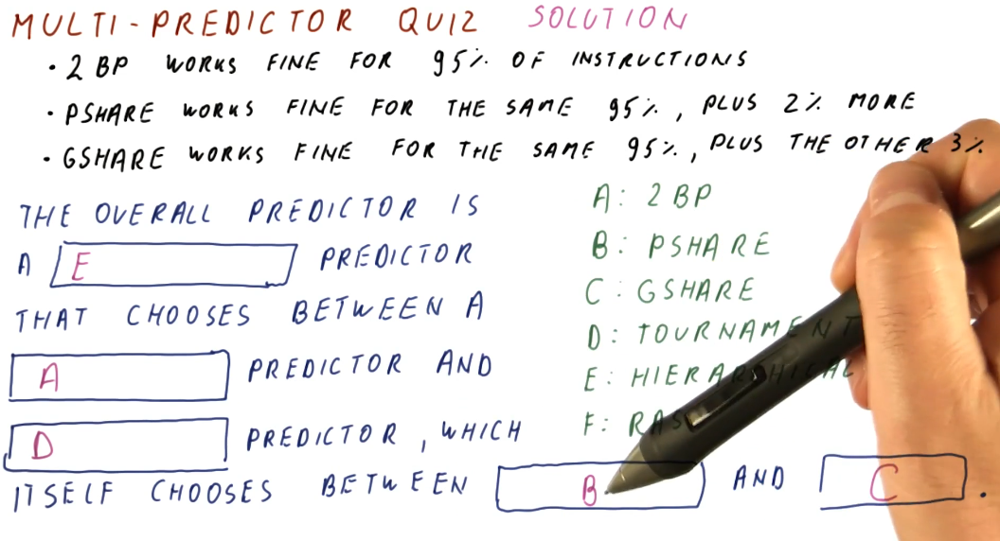

# Hierarchical Predictors

In contrast to [tournament predictors](./lesson4/../tournament-predictor.md),
a hierarchical combines 1 good predictor with 1 OK predictor instead of using
2 good predictors. The concern comes from the fact that, with the tournament
predictor, we're doing 2 predictions with 2 good predictors - some costly
operations. In the hierarchial predictor, we only use the OK predictor for easy
to guess branches. We use the good predictor for branches that are harder to
predict, this allows us to pay the price for good predictions less.

In a tournament predictor, we are updating both predictors for each branch
outcome. In the hierarchical predictor, we update the OK predictor for each
branch outcome and the good predictor only if the prediction made the OK
predictor was inaccurate.

Comparing the performance of the hierarchical predictor to the tournament
predictor, the hierarchical predictor wins more often. This is because a lot
of branches can be predicted easily with the OK predictor - we don't pay the
cost for good predictions as much as the tournament predictor does.

## Multi-predictor Quiz

Below is a quiz excerpt from the class that has us choose the predictor design
for a processor, using multiple predictions. The purpose is for us to understand
how to combine predictors to create hierarchical and tournament predictors to
tackle branch predictions with the most efficiency.

