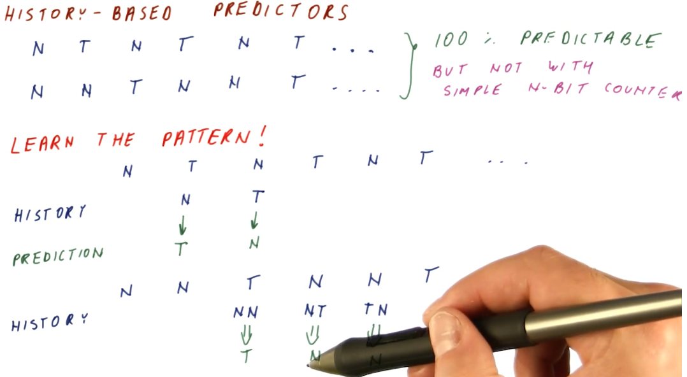
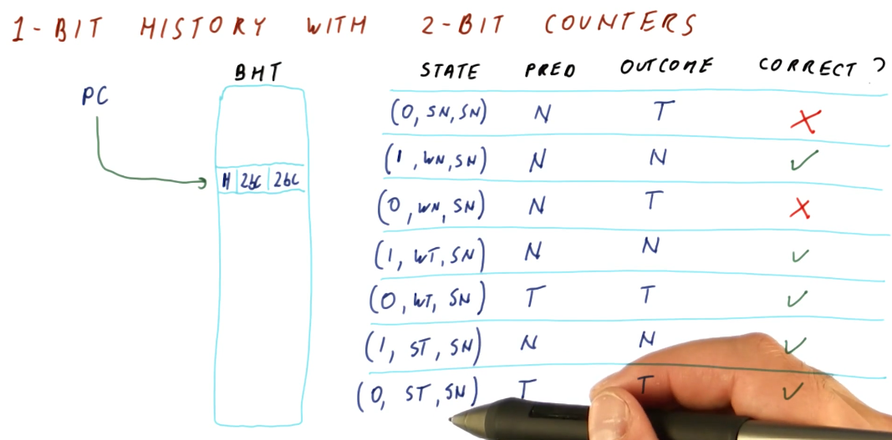
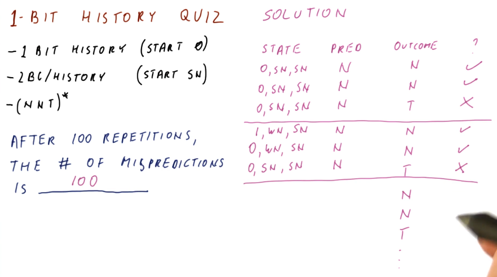
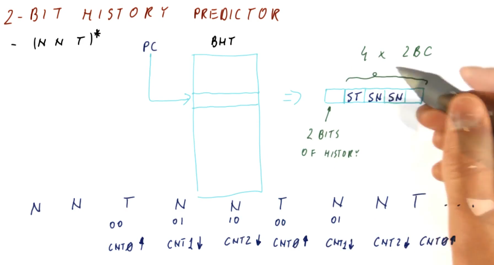
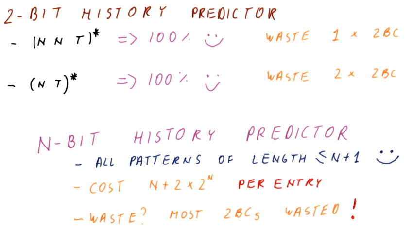
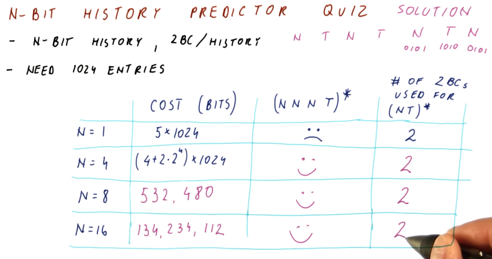
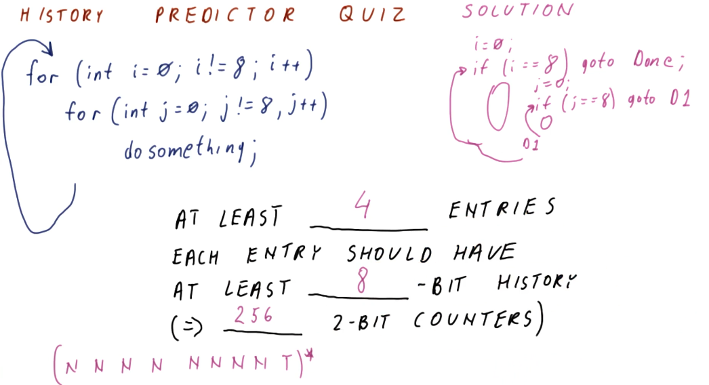

# History Based Predictors

History Based Predictors are designed to recognize and learn patterns based
upon the history of taken or not taken outcomes of a branch. Below is an example
that provides a high-level representation of the concept. The flip-floppy
branch outcomes are definitely predictable, just not with simple N-bit counters.

## 1 Bit History w/ 2BC

Below is an excerpt from the lectures that provides a high-level representation
of a BHT with 1 bit for history, and two 2BC's to manage the state for taken
and not taken branch outcomes.

What the 1 bit history 2BC BHT provides us is a predictor that is able to learn
the pattern of a series of branch outcomes. The 1 bit history bit is used to
index into the two 2BC's and, based upon the branch outcome, updates the state
of each 2BC.

## 1 Bit History Quiz

Below is an a quiz excerpt from the lectures demonstrating the calculation of
the number of mis-predictions for a pattern of branch outcomes following the
this pattern: `(NNT)*`. As we can see from the outcome of the calculations in
the quiz, the 1 Bit History with two 2BC's is not a good solution for this
pattern.

## 2 Bit History Predictor

The 2 Bit History Predictor works very similar to the 1 Bit History Predictor,
now we've just doubled the number of 2BCs. The 2 Bit History bits are used to
index into the four 2BCs. The total cost of the predictor is 10 bits per branch.
Below is a high-level representation of how a 2 Bit History Predictor can
perfectly predict the `(NNT)*` sequence.

Thinking more about our history predictors, some things become evident. For an
N-bit History Predictor:

* We can perfectly predict all patterns of length less than or equal to `N+1`.
* The cost for an N-bit History Predictor is `N + 2 * 2^N` **per entry**
* This is wasteful, most of the 2BCs will go unused.

## N-bit History Predictor Quiz

The below quiz is an excerpt from the lecture, outlining the cost and waste of
different size N-bit History Predictors.

## History Predictor Quiz

The below quiz is an excerpt from the lecture, demonstrating how to calculate
the number of entries in a history predictor necessary to support a branch
outcome pattern generated by these two `for` loops. As you can see, a lot of
2BCs are wasted just to support an 8 bit history.

