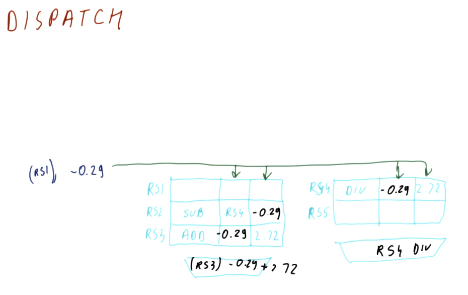
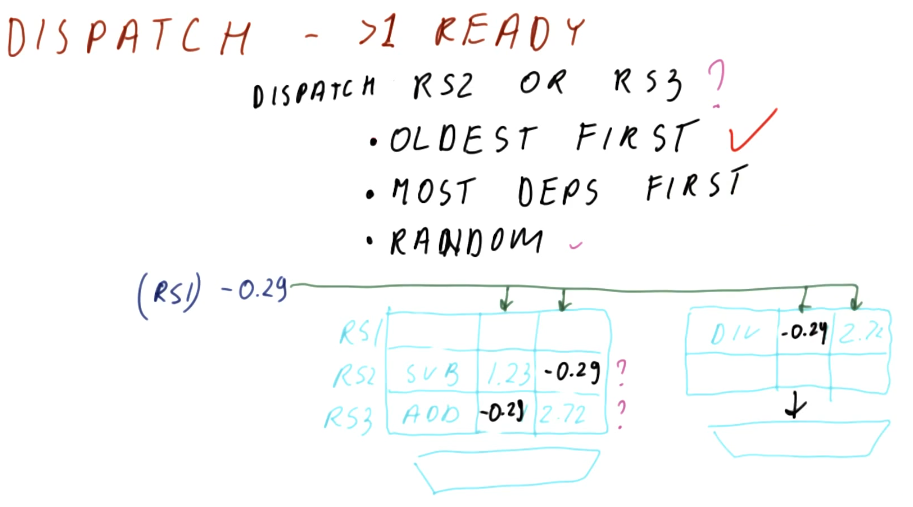
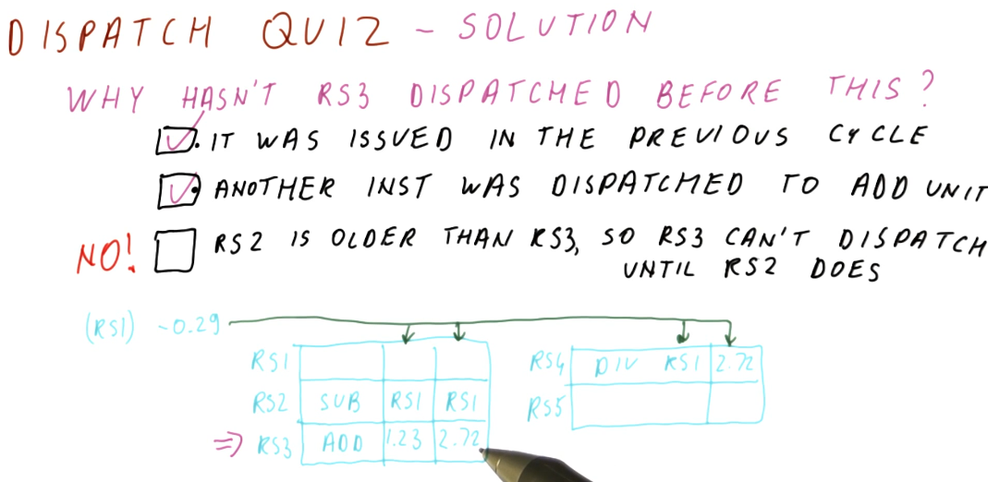

# Dispatching

Below is an excerpt from the class that showcases how dispatching works. The
results of an instruction from a reservation station is broadcast - its
generating reservation station number is attached to the value that it's
generating. Instructions that depend upon a value from that reservation station
are able to acquire the values necessary to be dispatched, and they will also
broadcast their results in the same manner.

## Dispatching when > 1 instruction is ready

Below is an excerpt from the lectures displaying a situation in which more than
one instruction in the reservation station is ready to execute. How do we go
about making the right decision for best performance? There are three options:

* **Dispatching the oldest instruction first** - the most fair option and most
balanced for performance.
* **Dispatching the instruction with the most dependencies** - the highest
performance option, however, it requires us to search all reservation stations
and determine dependencies - power hungry.
* **Randomly dispatching** - not a bad option, and at some point every
instruction will be dispatched, but performance could be degraded.

## Dispatch quiz

Below is a quiz from the lectures on dispatching. The quiz asks why the
instruction held in `RS3` hasn't executed before the current state of the
reservation stations. Three options are given, but only two are reasonable.

* The first option: "It was issued in the previous cycle" is reasonable because
there can definitely be a time in which the instruction was issued too late so
it didn't have time to execute.
* The second option: "Another instruction was dispatched to the adder" is
possible because maybe `RS1` was currently executing on the adder to generate a
value.
* The third option: "RS2 is older than RS3" is not reasonable. The whole purpose
of Tomasulo's algorithm is to support out-of-order execution. Instructions will
be executed as soon as their values are available, despite how old an
instruction is.

