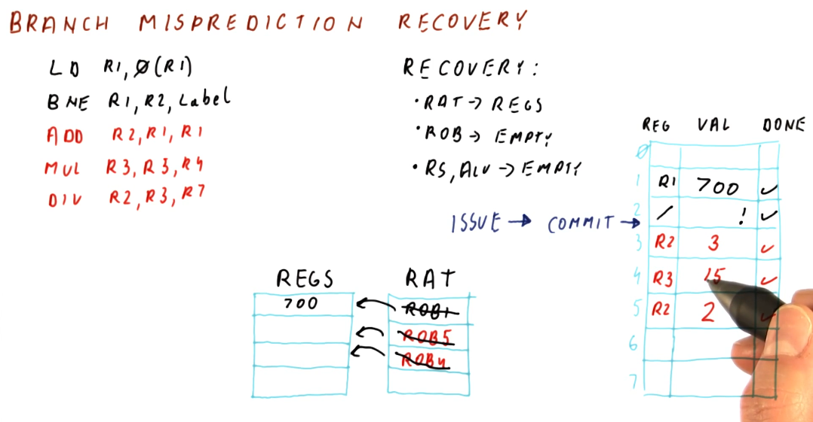
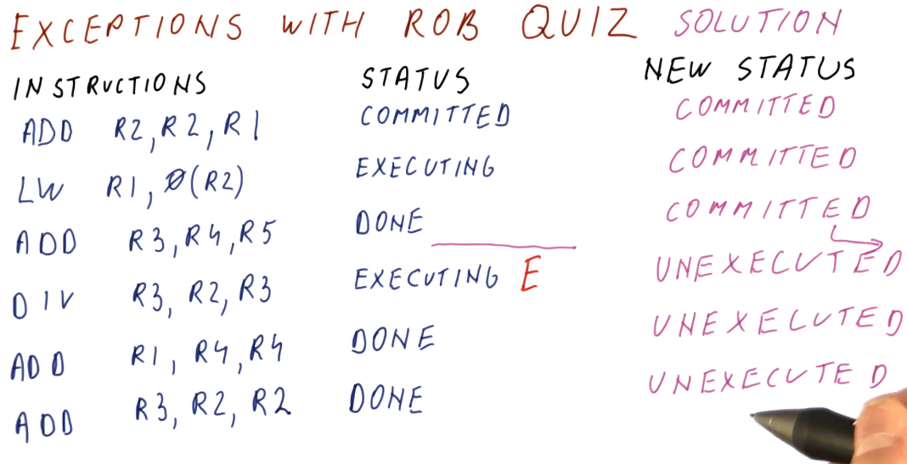

# Recovery

## Branch mis-prediction recovery part 1

The below excerpt from the lectures provides us a scenario in which a branch
mis-prediction occurs and the use of a ROB allows us to avoid writing incorrect
values to the registers. Because the instructions in **red** were never
supposed to execute in the first place, we avoid making mistakes.

The example gives us a step-by-step view of how values are updated in the RAT
and ROB when each instruction is issued, dispatched, and its values are
broadcasted.

## Branch mis-prediction recovery part 2

The below excerpt from the lectures further discusses what takes place when
we recover from branch mis-predictions using a ROB. In this example, we can see
that these steps are taken to fully recover from a mis-predicted branch:

* The RAT is cleared and points back to the values contained in the registers
* The ROB is "emptied" by resetting the **issue** pointer to the **commit**
pointer
* The reservation stations and the computational units (ALU / MUL, etc.) are
drained until they are empty

The mis-predicted branch is only noticed when the **commit** pointer in the ROB
sees that mis-predicted branch value in the branch's ROB entry.

## ROB and exceptions

In the below excerpt, we cover how exceptions are handled using ROB. In summary,
we treat exception as a result like they would be from any other operation. The
exceptional instructions are marked in the ROB and aren't handled until the
**commit** pointer arrives to them in the ROB. We delay the handling of
exceptions until they need to be committed - this provides us a good return
point for an exception handler and prevents us from writing the results of
instructions that took place out-of-order before we noticed the exception. This
also resolves the issue of **phantom exceptions** - if the branch was
mis-predicted we will end up ignoring the **phantom exception** so effectively
it never happened.

## Exceptions with ROB quiz

Below is a quiz from the lectures covering exceptions with ROB. A `DIV`
instruction caused a divide by zero error - to solve the quiz we must predict
the new state of the ROB when the exception is noticed.

## RAT updates on commit

The below excerpt from the lectures showcases how the registers and RAT are
updated using the ROB and why. Upon each commit, the values contained in the ROB
are written to the registers. The RAT, however, is not cleared or updated until
the corresponding ROB entry is committed. This is to help instructions that are
being issued to keep track of and use the most recent name for the outcome of a
register.

So why are we writing to the registers on each commit? Because, if an exception
takes place, all of the changes that are valid are written to the registers and
saved. The ROB can safely drain the instructions that aren't meant to be written
and the RAT can be cleared and updated to point to the registers.

