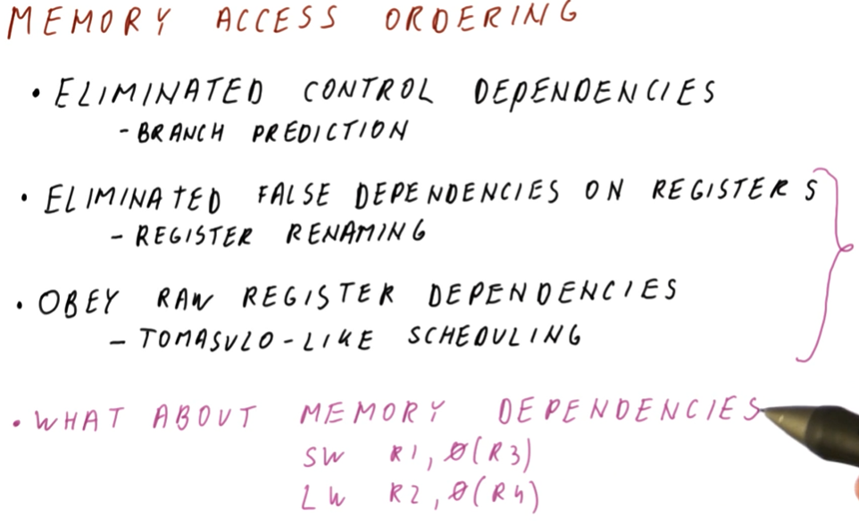

# Memory Ordering

In previous lectures we have seen that processors conducting out-of-order
execution can track when instructions use registers populated by preceding
instructions. In contrast, load and store instructions can reference values
located in memory, so how does a processor de-conflict load and store accesses
to values in memory when conducting out-of-order execution?

The notes for this lecture can be found [here](./pdf/Lesson9.pdf)

## Memory access ordering

So we've already demonstrated that we can resolve control dependencies by
implementing good branch prediction. We have eliminated false data dependencies
for registers using register renaming. We have also shown that out-of-order
execution can respect RAW or true dependencies by using Tomasulo-like scheduling
of instructions in reservation stations.

The two techniques we have used to eliminate data dependencies are only
applicable to operations involving registers. We still have to resolve
dependencies that manifest when conducting load and store instructions on the
same locations in memory. How do we execute these instructions out-of-order?

## Memory writes

For `store` instructions, knowing when memory writes actually happen is
important. Memory writes actually happen when an instruction **commits**.
Memory writes only happen when a **commit** takes place for an instruction
because it is dangerous to do so, otherwise. If we wrote to memory prior to an
instruction committing, that information could be written but the instruction
could be cancelled due to something like branch mis-prediction or an exception.

To resolve this issue, we delay **memory writes** and **stores** until the
instruction is **committed**.

So where and when do `load` instructions get their data? We want `load`
instructions to get their data as soon as possible. Do they always have to wait
until every `store` instruction commits?

To resolve this issue, computer architects implement a `load-store queue`
structure to keep all `load` and `store` instructions. More on this in the
next section.